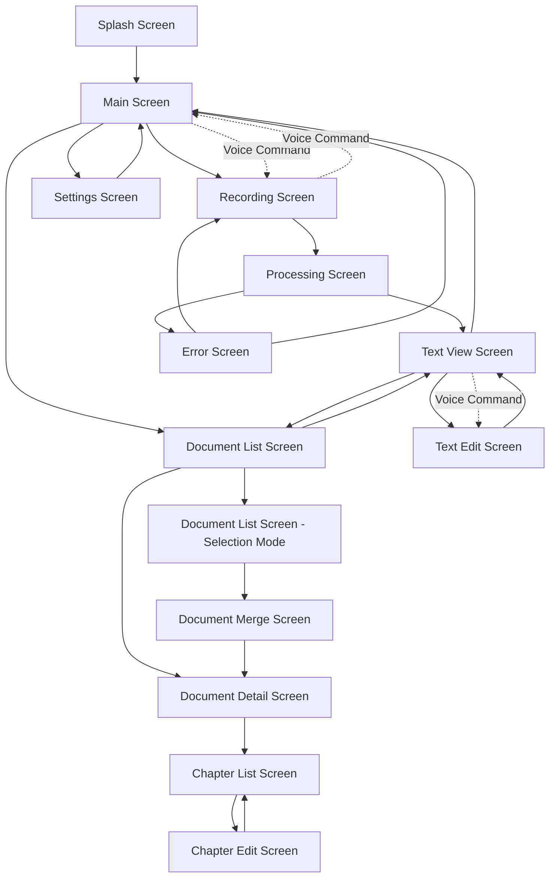
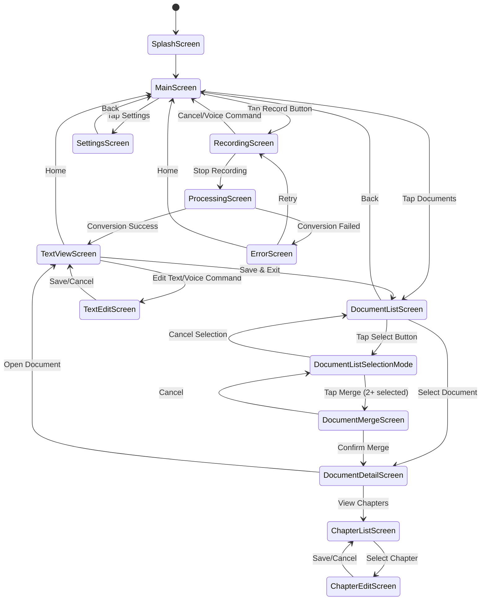
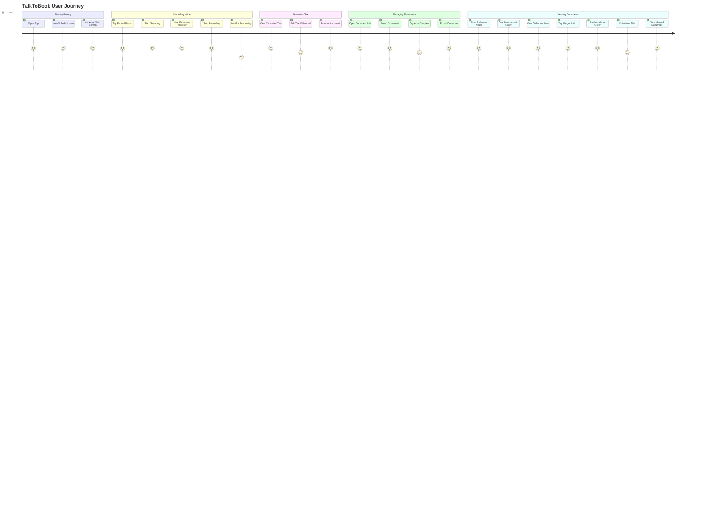
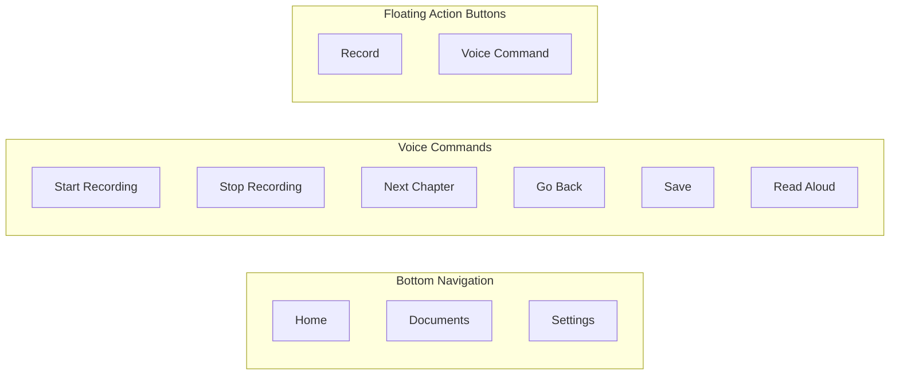
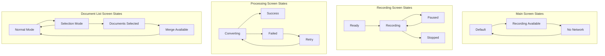
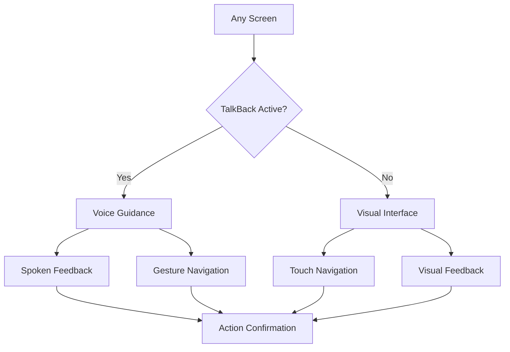
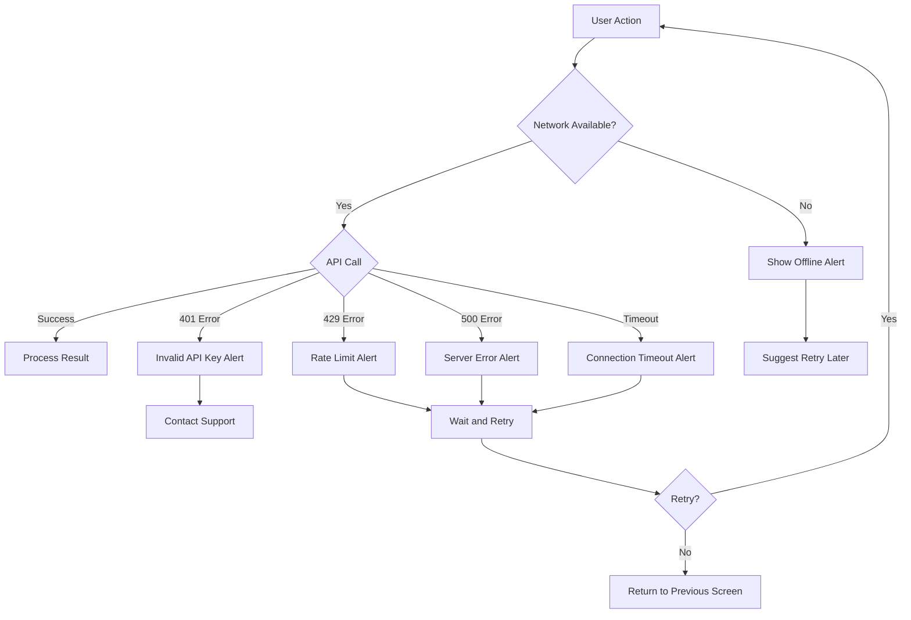
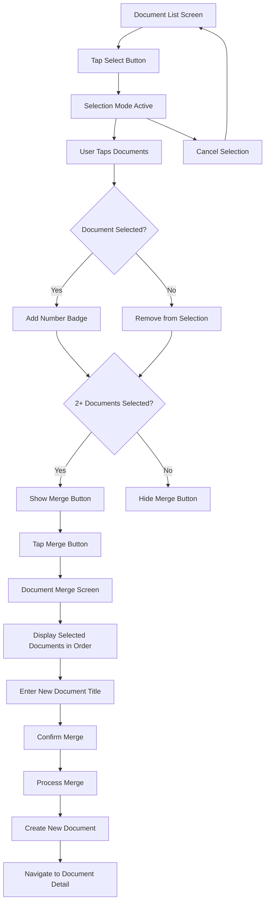

# TalkToBook Screen Transition Diagram

## Screen Flow Overview

## Detailed Screen Transitions

## User Journey Flow

## Navigation Components

## Screen States

## Accessibility Flow

## Error Handling Flow

## Document Merge Feature Details

## Notes

- All transitions include appropriate animations for senior users (minimal and clear)
- Voice commands are available on main screens for hands-free navigation
- Error states always provide clear recovery paths
- Back navigation is consistently available via gesture or voice command
- Auto-save ensures no data loss during any transition
- Document merge feature uses tap order for intuitive ordering (numbered badges show selection order)
- Merge operation creates a new document while preserving originals